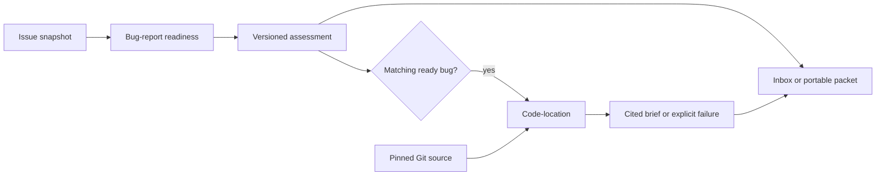

# Focused agents and artifact handoffs

Living document. Rationale:
[ADR-0004](../adr/0004-compose-bounded-maintenance-agents.md).
Contracts: [readiness](../specs/bug-readiness.md),
[code-location](../specs/code-location.md), and
[investigation packets](../specs/investigation-packet.md).

## Overview

Two small agents provide investigation inputs for OSS maintainers. Application
code acquires issue snapshots and pinned source, selects the subscription and
model, decides eligibility, and presents results. An agent's output grants no
new authority to another agent or its consumer.

## Design

Readiness distinguishes request kind from investigation readiness. Feature requests
and questions receive classifications without an acceptance decision. Missing
information produces focused questions with quoted issue evidence.

Code-location consumes a matching ready assessment and caller-pinned Git commit.
Bounded source tools expose paths, literal search, excerpts, and test navigation
hints. Only inspected excerpts can support final citations. The host validates
citations, aggregates correction feedback, and produces the v2/v3 overview from
validated fields. The model still chooses locations and writes reasons and
uncertainties; exact citations do not guarantee useful selections.

The [inbox](../specs/inbox.md) adds bounded intake, freshness, durable attempts,
and local presentation. The [packet](../specs/investigation-packet.md) demonstrates
a second consumer: Markdown for a contributor and JSON with the original records
and provenance. Both call the same bounded functions. Neither needs a third agent
to rewrite results or a shared conversation between agents.

The [factor mapping](twelve-factors.md) explains the implementation choices.
[Composable agents](composable-agents.md) records the “taco-bell orchestration”
idea and current recipes; external orchestrator integrations remain unproven.

Version 3 adds per-test direct/adjacent relevance and a separate completed/unfinished
bounded-search explanation. These model judgments are visible in both consumers;
the host still validates exact evidence without claiming coverage or execution.
The [capability catalog](../../capabilities/catalog.json) describes the two callable
agents. A [common event view](../specs/agent-discovery.md) projects validated run and
packet artifacts into portable lifecycle and provenance metadata.

## Operational notes

Source acquisition and credentials belong at the application edge. Source tools
read Git blobs; they never run the target repository's tests or other code.
Budgets, persisted failures, hashes, and historical schema support are part of
[the location contract](../specs/code-location.md). Reuse requires matching
provenance, not simply an issue number.

Use `npm run verify` and `npm run demo` without credentials. Live evaluations
require a configured subscription and currently use Terra only. The
[validation design](validation.md) and [evaluation plan](../plans/evaluations.md)
separate runtime success, citation grounding, semantic relevance, and independent
maintainer acceptance.

## References

- Rationale: [ADR-0004](../adr/0004-compose-bounded-maintenance-agents.md).
- Contracts: [readiness](../specs/bug-readiness.md),
  [code-location](../specs/code-location.md),
  [inbox](../specs/inbox.md), [packet](../specs/investigation-packet.md),
  [batch evaluation](../specs/batch-evaluation.md).
- Built in: [roadmap — Phase 1](../plans/roadmap.md#phase-1--readiness-foundation)
  through [Phase 4](../plans/roadmap.md#phase-4--portable-composition).
- Evidence: [evaluation plan](../plans/evaluations.md).

Follow-through: [ADR-0005](../adr/0005-test-relevance-and-portable-agent-discovery.md),
[discovery contract](../specs/agent-discovery.md), and [backlog](../plans/backlog.md).

## Repository briefing capabilities

The [repository brief contract](../specs/repository-brief.md) adds three focused
capabilities for a concrete maintainer consumer: grouping supplied issue/PR titles
and labels, interpreting calculated health evidence, and proposing up to N
evidence-linked actions. Collection, arithmetic and rendering remain ordinary
functions. These do not expand readiness or source-location responsibilities.
See [ADR-0010](../adr/0010-compose-a-repository-brief-from-bounded-evidence.md),
[packages and recipes](packages-and-recipes.md), and
[backlog P7](../plans/backlog.md#phase-7--repository-brief).
