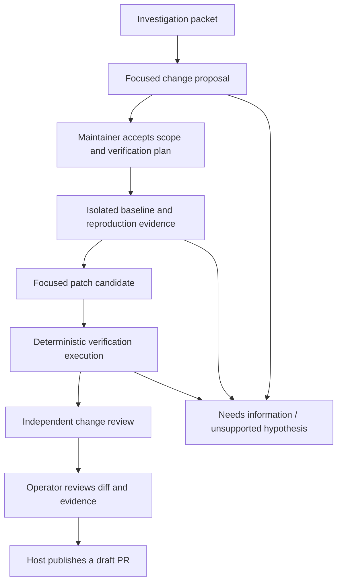

# From investigation evidence to a reviewable change

Living exploration, recorded 2026-09-18. **Proposed direction; no repair, test
execution or publication capability is implemented or authorized by this document.**
Current rationale: [ADR-0012](../adr/0012-operate-saved-workflows-through-a-local-console.md).
Current contracts: [investigation packet](../specs/investigation-packet.md),
[operator console](../specs/operator-console.md). Future boundaries need explicit
contracts and ADRs as each phase is accepted.

## Overview

A ready bug report and cited source locations establish a useful place to start.
They do not establish a correct diagnosis, reproducer, fix or safe merge. Moving
toward a PR crosses three additional authority boundaries: modifying a workspace,
executing untrusted project code, and publishing a remote artifact. Those effects
belong to separate host adapters with separate operator permissions.

The next smallest useful agent is a **change-proposal agent**. Given a frozen
investigation packet and bounded additional source evidence, it should produce a
reviewable repair specification: observed behavior, intended behavior, competing
explanations, missing evidence, proposed change scope and measurable acceptance
criteria. It can say `needs_information` or `not_actionable`. It cannot turn a
hypothesis into a proven diagnosis or treat a feature request as accepted/rejected.

## Design

### Separate jobs and artifacts

| Component | One output | Boundary |
| --- | --- | --- |
| Change-proposal agent | Acceptance criteria, evidence-linked hypotheses and bounded scope | Read-only, no execution or fix claims |
| Verification-plan judgment | Candidate checks and why they discriminate the bug from setup failure | Proposes commands/tests; cannot authorize execution |
| Workspace/runner adapter | Immutable base, command receipts and captured bounded results | Deterministic setup/execution under explicit policy |
| Patch agent | One candidate diff against the accepted base and scope | Writes only inside an isolated permitted workspace |
| Verification adapter | Baseline-versus-candidate results, logs and exact revisions | Does not judge its own success from agent prose |
| Change-review agent | Evidence-linked concerns about the candidate and test sufficiency | Independent context, read-only, cannot merge |
| Publication adapter | Draft PR identity and remote-effect receipt | Explicit operator authorization for repository, branch, diff and text |

This is a decomposition hypothesis, not a requirement to add six new agents at
once. Verification planning can initially be a human-owned part of the proposal.
The publisher and executor are deterministic functions. Add model judgments only
when a distinct input/output decision and useful evaluation can be demonstrated.

### Contracts and provenance before longer loops

Every artifact should identify schema version, operation/run/parent IDs, source
repository and full base commit, issue snapshot hash, accepted proposal revision,
input artifact hashes, execution configuration and limits. A candidate carries
a diff hash; a test result carries the tested tree/hash and exact command/environment
identity. Review and publication authorization bind to that same diff and evidence.
Changing the issue, base, proposal, tests or candidate invalidates the relevant
approval rather than silently carrying it forward.

Keep facts, hypotheses and proposed actions separate. A citation proves an excerpt
was inspected. A passing test proves that invocation's observed result. Neither
alone proves that the user's problem is solved. Preserve failed attempts, setup
errors, inconclusive reproductions and partial checks as first-class outcomes.

### Prove the problem before trusting a fix

Start with an operator-approved reproduction/check on the unmodified base. Record
whether it fails for the reported behavior, fails because setup is broken, passes,
or cannot run in the available environment. A missing dependency, timeout, import
error or absent credential is not a successful reproduction.

For a regression test, compare the same check against base and candidate: it should
fail at the relevant assertion on the base and pass on the candidate. Run a bounded
set of adjacent existing tests as well. Where the bug cannot be reproduced locally,
retain that uncertainty and require a maintainer's explicit decision about whether
the available alternative evidence is sufficient. Do not automatically publish an
unreproduced candidate as a verified fix.

Test integrity is part of review: deleting assertions, widening expectations,
skipping failing cases, changing test selection or weakening CI cannot silently
supply a green result. Preserve the original check and explain any intentional
change to the accepted specification. Count flakiness and environmental uncertainty
instead of retrying until a favorable result appears.

### Execute under an explicit host policy

Repository instructions, scripts and model tool arguments are untrusted inputs.
A Git worktree separates files but is not a security sandbox. The first executing
PoC needs a disposable sandbox with explicit CPU/memory/disk/time limits, no host
credentials, no host sockets, restricted mounts and a default-deny network policy.
Dependency installation is itself code execution and needs a separately bounded,
recorded provisioning step. Pin the image/toolchain and dependency inputs where
possible; do not call a moving install reproducible.

The operator configures permitted repositories, writable paths, commands and any
network exceptions. Reject path traversal, symlink escapes, submodule surprises,
credential files and unsolicited workflow/release edits. The patch worker cannot
expand these permissions, select a new target repository, or access publication
credentials. The current source adapter remains read-only.

### Bound candidate generation and review

The initial patch trial should admit one issue and one candidate, with one explicit
revision opportunity after useful failure feedback. Use a shared admission/time
allowance across proposal, patch and review; retries consume it. Stop on conflicting
requirements, no usable reproduction, setup failure, scope expansion, stale base
or exhausted budgets. Preserve the best available artifact and the stop reason.

Independent review should receive the accepted specification, baseline result,
candidate diff, verification results and source citations. It should not inherit
the patch agent's conversation or accept its self-reported success. Deterministic
checks and model review remain distinct from maintainer acceptance.

### Publish a concrete reviewed result

Publication should start with a draft PR in an operator-owned fixture repository.
The maintainer sees the exact diff, target/base/head, PR title/body, test evidence
and limitations before authorization. Sending a draft PR is a remote write;
approval to run analysis or create a local patch does not grant that write.

Persist a stable publish intent before pushing/creating the PR. Use stable branch
and operation identities, inspect remote state after ambiguous outcomes, and never
create a second PR merely because the success response was lost. A head/base
change invalidates stale review. Recovery must distinguish local patch creation,
branch publication, PR creation and merge. Merging is outside this proposed PoC.

### Measure separate outcomes

Track proposal usefulness, unsupported diagnoses, valid reproduction rate, candidate
scope compliance, baseline/candidate test outcomes, retained existing coverage,
review findings, maintainer acceptance and remote-effect reliability separately.
Measure total invocations, elapsed time and reported token usage; leave unknown
subscription cost unknown. No model-comparison harness is required for this step.
Use Copilot/Codex with Terra under the existing evaluation policy.

## Operational notes

The first next slice is **read-only change proposals from a few frozen packets**.
Use clear reproductions, incomplete reports and misleading location leads to test
whether it asks for missing evidence instead of inventing a repair plan. Assistant
review can assess structure and grounding; maintainer acceptance is a separate
measurement. Do not ask the user to grade a large batch before this boundary has
produced concrete useful examples.

After accepting that slice, prove isolated execution on a deliberately small,
operator-owned fixture repository with a known bug and test. Only then attempt one
local patch and an independent review. Remote publication follows after those
artifacts and effect boundaries are demonstrably useful. The existing `get-bb/bb`
work remains read-only throughout the current phase.

## References

- Current rationale: [ADR-0012](../adr/0012-operate-saved-workflows-through-a-local-console.md),
  [bounded composition ADR](../adr/0004-compose-bounded-maintenance-agents.md).
- Current contracts: [packet](../specs/investigation-packet.md),
  [operator console](../specs/operator-console.md).
- Proposed sequence and gates: [change workflow plan](../plans/investigation-to-pr.md).
- Roadmap direction: [backlog P10](../plans/backlog.md#phase-10--change-proposals-planned).
- Reusable pattern: [composable agents](composable-agents.md),
  [packages and recipes](packages-and-recipes.md).
