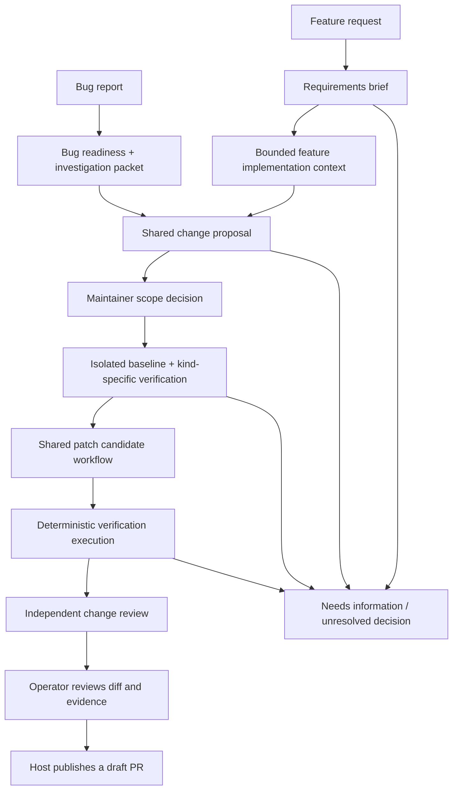

# From bug reports and feature requests to a reviewable change

Living exploration, recorded 2026-09-18. **Proposed direction; no repair, test
execution or publication capability is implemented or authorized by this document.**
Shared bug/feature direction: [ADR-0013](../adr/0013-converge-bugs-and-features-on-a-shared-change-proposal.md).
Current operator rationale: [ADR-0012](../adr/0012-operate-saved-workflows-through-a-local-console.md).
Current contracts: [investigation packet](../specs/investigation-packet.md),
[operator console](../specs/operator-console.md). Future boundaries need explicit
contracts and ADRs as each phase is accepted.

## Overview

A ready bug report and cited source locations establish a useful place to start.
They do not establish a correct diagnosis, reproducer, fix or safe merge. Moving
toward a PR crosses three additional authority boundaries: modifying a workspace,
executing untrusted project code, and publishing a remote artifact. Those effects
belong to separate host adapters with separate operator permissions.

The next smallest useful shared agent is a **change-proposal agent**. Its one job
is to specify a grounded, reviewable change. Bug preparation supplies a frozen
investigation packet; feature preparation supplies a requirements brief and bounded
source context. The result names desired behavior, scope, acceptance criteria,
verification needs and unresolved decisions. It can return `needs_information`
without accepting or rejecting the underlying request.

## Design

### Distinct preparation, shared implementation

| Concern | Bug report | Feature request |
| --- | --- | --- |
| Input evidence | Actual versus expected behavior, environment, reproduction, relevant source/tests | User need, desired outcome, example scenarios, constraints and relevant extension points |
| Preparation | Existing bug readiness and investigation packet | Future requirements brief and feature-context capability |
| Missing information | Incomplete reproduction, uncertain expectation or unsupported hypothesis | Ambiguous scope, conflicting examples, unclear compatibility or unresolved product choice |
| Baseline | Reproduce the reported behavior and distinguish setup failures | Record existing behavior and compatibility checks; document the requested capability gap |
| Candidate evidence | Relevant regression fails on base and passes on candidate, plus adjacent checks | Accepted scenarios pass on candidate; existing behavior stays compatible except for approved changes |
| Shared continuation | Change proposal → bounded candidate → verification → review → authorized publication | Same artifacts and workers, with feature-specific verification obligations |

A feature requirements brief should capture the affected user/workflow, desired
observable behavior, concrete happy-path and edge/negative examples, non-goals,
constraints, API/data/configuration compatibility, migration/documentation needs,
and open decisions. Proposals must distinguish requester preferences from recorded
maintainer decisions and inspected repository facts. Unknowns stay unknown; agents
must not invent product policy, priorities or acceptance.

The future feature-context job identifies relevant interfaces, extension points,
related implementation and tests at a pinned commit. It can reuse the existing
bounded Git source adapter, but needs its own input/output contract and evaluation.
The current bug-only `code-location` capability remains unchanged. An existing
feature classification has `bug_readiness: not_applicable`; that remains valid and
does not block a future feature-specific handoff. P9 currently stops after that
classification and has no requirements or feature-context execution path.

Mixed requests need an explicit scope decision: split independent work or record
one accepted proposal with named component criteria. A claimed bug can instead
expose an intentional behavior change; record the correction with provenance rather
than silently rewriting historical classification or forcing one profile to fit.

### Separate jobs and artifacts

| Component | One output | Boundary |
| --- | --- | --- |
| Bug preparation | Existing investigation packet | Existing ready-bug-only locator boundary |
| Feature requirements agent | Requirements brief, scenarios, constraints and unresolved decisions | Read-only; does not accept the feature for the project |
| Feature-context agent | Bounded source/test extension points at a pinned commit | Proposed separate capability using the existing source adapter |
| Shared change-proposal agent | Acceptance criteria, evidence-linked rationale and bounded scope | Read-only; consumes explicit bug/feature input variants |
| Verification-plan judgment | Checks that discriminate the requested behavior from setup failure | Proposes commands/tests; cannot authorize execution |
| Workspace/runner adapter | Immutable base, command receipts and captured bounded results | Deterministic setup/execution under explicit policy |
| Patch agent | One candidate diff against the accepted base and scope | Writes only inside an isolated permitted workspace |
| Verification adapter | Baseline-versus-candidate results, logs and exact revisions | Does not judge its own success from agent prose |
| Change-review agent | Evidence-linked concerns about the candidate and test sufficiency | Independent context, read-only, cannot merge |
| Publication adapter | Draft PR identity and remote-effect receipt | Explicit operator authorization for repository, branch, diff and text |

This is a decomposition hypothesis, not a requirement to add all these capabilities at
once. Verification planning can initially be a human-owned part of the proposal.
The publisher and executor are deterministic functions. Add model judgments only
when a distinct input/output decision and useful evaluation can be demonstrated.
Initially a human-authored feature requirements brief can exercise the shared
proposal boundary before a separate requirements agent is qualified.

### Contracts and provenance before longer loops

Every artifact should identify schema version, operation/run/parent IDs, source
repository and full base commit, issue snapshot hash, change kind (`bug_fix` or `feature`), accepted proposal revision,
input artifact hashes, execution configuration and limits. A candidate carries
a diff hash; a test result carries the tested tree/hash and exact command/environment
identity. Review and publication authorization bind to that same diff and evidence.
Changing the issue, base, proposal, tests or candidate invalidates the relevant
approval rather than silently carrying it forward.

The proposed shared proposal envelope carries the desired outcome, explicit scope
and non-goals, individually identified acceptance criteria, evidence references,
open decisions, source/base identity, verification profile, and compatibility,
migration and documentation obligations. Its input is a discriminated variant:
`bug_fix` references bug investigation evidence; `feature` references requirements
and feature-context evidence. These are design fields, not shipped schemas.

Maintain four separate facts: request kind, evidence/requirements sufficiency,
maintainer scope decision, and execution/publication authorization. A structurally
complete proposal is not project acceptance. Maintainer acceptance is recorded by
the host and bound to the proposal revision, never inferred from an agent's prose.
Explicit intent in the original request or an existing decision can supply that
authorization within its recorded scope; do not require duplicate approvals.

Keep facts, hypotheses and proposed actions separate. A citation proves an excerpt
was inspected. A passing test proves that invocation's observed result. Neither
alone proves that the user's problem is solved. Preserve failed attempts, setup
errors, inconclusive reproductions and partial checks as first-class outcomes.

### Verify bugs and features against their criteria

For a bug fix, start with an operator-approved reproduction/check on the unmodified base. Record
whether it fails for the reported behavior, fails because setup is broken, passes,
or cannot run in the available environment. A missing dependency, timeout, import
error or absent credential is not a successful reproduction.

For a regression test, compare the same check against base and candidate: it should
fail at the relevant assertion on the base and pass on the candidate. Run a bounded
set of adjacent existing tests as well. Where the bug cannot be reproduced locally,
retain that uncertainty and require a maintainer's explicit decision about whether
the available alternative evidence is sufficient. Do not automatically publish an
unreproduced candidate as a verified fix.

For a feature, establish a baseline of existing behavior and map every accepted
criterion to a check or an explicitly recorded verification gap. A new acceptance
test may fail on the base because the capability is absent. That is feature-gap
evidence, not proof of an existing bug. When a new interface makes the base test
inapplicable, record `not_applicable` with a reason and use a compatible baseline
check where possible; never count an import/setup failure as satisfying the
criterion. Do not waive candidate acceptance or compatibility checks merely because
the base cannot expose the new interface.

For example, a requested CSV export needs an agreed column/ordering contract,
escaping and empty-data examples, access rules where applicable, and bounded size
expectations. Verification should exercise those criteria plus retained existing
export behavior. It does not need to allege that the absence of CSV was a defect.
Schema/configuration/API changes may also require migration, upgrade/downgrade or
documentation evidence, as explicitly selected in the proposal.

Test integrity is part of review: deleting assertions, widening expectations,
skipping failing cases, changing test selection or weakening CI cannot silently
supply a green result. Preserve the original check and explain any intentional
change to the accepted specification. Count flakiness and environmental uncertainty
instead of retrying until a favorable result appears.

### Execute under an explicit host policy

Repository instructions, scripts and model tool arguments are untrusted inputs.
A Git worktree separates files but is not a security sandbox. The first executing
PoC needs a disposable sandbox with explicit CPU/memory/disk/time limits, no host
credentials, no host sockets, restricted mounts and a default-deny network policy.
Dependency installation is itself code execution and needs a separately bounded,
recorded provisioning step. Pin the image/toolchain and dependency inputs where
possible; do not call a moving install reproducible.

The operator configures permitted repositories, writable paths, commands and any
network exceptions. Reject path traversal, symlink escapes, submodule surprises,
credential files and unsolicited workflow/release edits. The patch worker cannot
expand these permissions, select a new target repository, or access publication
credentials. The current source adapter remains read-only.

### Bound candidate generation and review

The initial patch trial should admit one issue and one candidate, with one explicit
revision opportunity after useful failure feedback. Use a shared admission/time
allowance across proposal, patch and review; retries consume it. Stop on conflicting
requirements, missing required bug/feature verification evidence, setup failure, scope expansion, stale base
or exhausted budgets. Preserve the best available artifact and the stop reason.

Independent review should receive the accepted specification, baseline result,
candidate diff, verification results and source citations. It should not inherit
the patch agent's conversation or accept its self-reported success. Deterministic
checks and model review remain distinct from maintainer acceptance.

### Publish a concrete reviewed result

Publication should start with a draft PR in an operator-owned fixture repository.
The maintainer sees the exact diff, target/base/head, PR title/body, test evidence
and limitations before authorization. Sending a draft PR is a remote write;
approval to run analysis or create a local patch does not grant that write.

Persist a stable publish intent before pushing/creating the PR. Use stable branch
and operation identities, inspect remote state after ambiguous outcomes, and never
create a second PR merely because the success response was lost. A head/base
change invalidates stale review. Recovery must distinguish local patch creation,
branch publication, PR creation and merge. Merging is outside this proposed PoC.

### Measure separate outcomes

Track proposal usefulness, unsupported diagnoses, valid reproduction rate, candidate
scope compliance, baseline/candidate test outcomes, retained existing coverage,
review findings, maintainer acceptance and remote-effect reliability separately.
For features, additionally measure requirement invention/omission, unresolved-choice
handling, acceptance-criterion coverage and compatibility/migration gaps. Do not
aggregate feature acceptance checks into a bug reproduction score.
Measure total invocations, elapsed time and reported token usage; leave unknown
subscription cost unknown. No model-comparison harness is required for this step.
Use Copilot/Codex with Terra under the existing evaluation policy.

## Operational notes

The first next slice is **shared read-only change proposals from bug and feature
evidence**. Use a few frozen bug packets and explicit feature requirements/source
briefs, including ambiguous and incompatible requests, to test whether the agent
asks for missing evidence instead of inventing requirements or a repair plan. Assistant
review can assess structure and grounding; maintainer acceptance is a separate
measurement. Do not ask the user to grade a large batch before this boundary has
produced concrete useful examples.

After accepting that slice, prove isolated execution on a deliberately small,
operator-owned fixture repository with both a known bug and a small requested
feature. Then try one local candidate per request kind through the shared patch
and independent-review workflow. Remote publication follows after those
artifacts and effect boundaries are demonstrably useful. The existing `get-bb/bb`
work remains read-only throughout the current phase.

## References

- Shared direction: [ADR-0013](../adr/0013-converge-bugs-and-features-on-a-shared-change-proposal.md).
- Current rationale: [ADR-0012](../adr/0012-operate-saved-workflows-through-a-local-console.md),
  [bounded composition ADR](../adr/0004-compose-bounded-maintenance-agents.md).
- Current contracts: [packet](../specs/investigation-packet.md),
  [operator console](../specs/operator-console.md).
- Proposed sequence and gates: [change workflow plan](../plans/investigation-to-pr.md).
- Roadmap direction: [backlog P10](../plans/backlog.md#phase-10--change-proposals-planned).
- Reusable pattern: [composable agents](composable-agents.md),
  [packages and recipes](packages-and-recipes.md).
