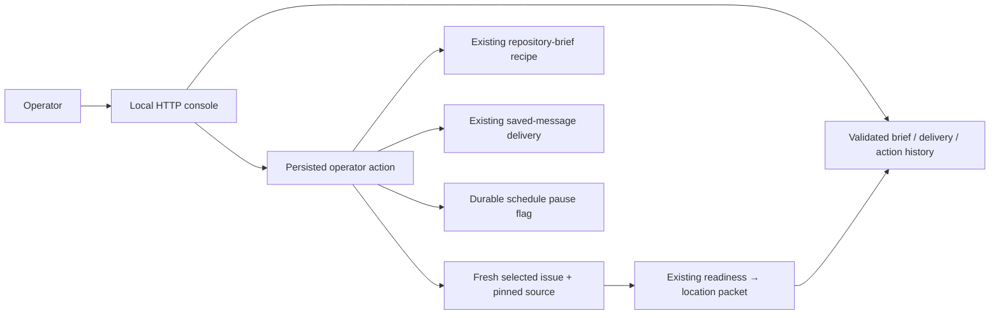

# Local maintainer operator console

Living document. Rationale: [ADR-0012](../adr/0012-operate-saved-workflows-through-a-local-console.md).
Contracts: [operator console](../specs/operator-console.md),
[scheduled delivery](../specs/scheduled-delivery.md), [inbox](../specs/inbox.md).

## Overview

The console brings saved repository briefs, the existing issue inbox, delivery
status and bounded follow-up actions into one loopback browser surface. It reads
artifacts directly and calls the existing recipes; it introduces no agent.

## Design

The operator config maps stable job IDs to local delivery settings, state, saved
brief roots, an optional issue inbox, timer unit and pinned source checkout. Browser
requests supply IDs and expected hashes. Paths, recipients, providers, source
commits and transport settings come from that configuration.

The history reader validates records, deduplicates exact copies, rejects conflicting
copies of a workflow identity, and exposes counts of unreadable/corrupt records.
All reports preserve evidence coverage and unknown measurements. Job status shows
the configured next occurrence separately from observed systemd timer activation.
A paused flag governs admissions inside the schedule adapter, leaving active work
and the external scheduler intact. Explicit run-now actions still work while paused.

A recorded operator request is the authority for a bounded action. Its UUID handles
HTTP replay; a second click selecting the same brief/issue/source configuration
returns the existing investigation. An exclusive action lock serializes console
work. A interrupted request remains visible without automatic replay. Delivery
retains its own effect ledger and unknown-send reconciliation rules.

Investigation selection is restricted to an issue in the chosen saved open-issue
sample. The host validates its configured source, fetches current issue text, and
records that fresh snapshot before calling the existing packet recipe. Closed or
invalid reports stop. Readiness classifies the request; location runs only for a
ready bug report. The operator action links the aggregate parent brief to the
packet and pinned commit. Existing agent prompts and authorities do not change.

The local HTTP boundary checks Host and Origin, uses CSRF tokens, limits submitted
body size and rejects fields outside the action schema. Artifact routes resolve
through configured roots, refuse path escapes, and send inert reports with restrictive
content policies. No arbitrary file browser or generic command execution endpoint
is exposed. Local processes and operator-owned files are trusted; remote/multiuser
hosting requires a separate authentication and authorization design.

## Operational notes

Run `npm run inbox -- serve --config PRIVATE_CONFIG`. The default address is
`http://127.0.0.1:8765/`. Keep private configuration/state outside Git. Browser
pages show stored facts; refresh to see completed work. An active action page
refreshes every five seconds. A reboot or hard kill can leave `.action.lock`:
verify the prior worker is stopped and inspect child artifacts before manually
removing it. Removing a lock does not authorize replay of an interrupted action.

The original static issue inbox remains available through the configured job and
can still be generated with its existing CLI. No automatic issue refresh is added.
A stale source checkout remains pinned; the operator must deliberately update it.

## References

- Rationale: [ADR-0012](../adr/0012-operate-saved-workflows-through-a-local-console.md).
- Contracts: [operator console](../specs/operator-console.md),
  [investigation packet](../specs/investigation-packet.md),
  [scheduled delivery](../specs/scheduled-delivery.md).
- Built in: [backlog P9](../plans/backlog.md#phase-9--operator-console),
  [roadmap Phase 13](../plans/roadmap.md#phase-13--operator-console).
- Next exploration: [investigation to PR](investigation-to-pr.md).

## Shared proposal continuation

Under [ADR-0014](../adr/0014-draft-read-only-proposals-from-frozen-evidence.md), a
completed investigation can enter the [proposal recipe](../specs/change-proposal.md)
through an exact saved-parent handoff. Bugs reuse source evidence; features require
an operator-selected source literal. The page renders scope, criteria, checks and
open questions with acceptance still unrecorded. This implements
[backlog P10](../plans/backlog.md#phase-10--change-proposals); later execution remains
in the [change workflow design](investigation-to-pr.md).

## Owned fixture history

The [fixture execution design](fixture-execution.md), governed by
[ADR-0015](../adr/0015-isolate-fixture-verification-and-scoped-patches.md), adds a
read-only `/fixtures` view over configured roots. It exposes base/candidate checks,
review findings, exact diff and provenance without adding browser execution actions.
This completes visibility for [P11/P12](../plans/backlog.md#phase-11--isolated-fixture-verification)
under the [fixture contract](../specs/fixture-execution.md).

Owned-fixture publication is now a separate [approved-bundle boundary](../specs/draft-publication.md), under [ADR-0016](../adr/0016-publish-only-approved-fixture-bundles.md). Fixture results themselves retain `publication: not_authorized`.
