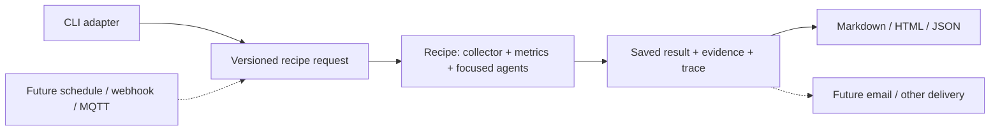

# Agent packages, recipes, and adapters

Living document. Rationale: [ADR-0010](../adr/0010-compose-a-repository-brief-from-bounded-evidence.md).
Contracts: [repository brief](../specs/repository-brief.md), [discovery](../specs/agent-discovery.md).

## Overview

Onionsoup packages focused judgments with supporting deterministic functions and
composes them through ordinary application recipes. A trigger adapter translates
an event or command into a versioned request; a delivery adapter consumes a saved
result. Agents have no knowledge of the transport that invoked them.

## Design

### Current local bundle

[src/repository-brief/index.ts](../../src/repository-brief/index.ts) is the local
bundle's public import surface. This is source packaging inside the repository,
not a published npm package, separate service or container per agent.

| Component | Ownership |
| --- | --- |
| `contracts.ts`, `agents.ts`, `capabilities.ts` | Three callable capabilities, prompts, schemas, validation, limits and manifests |
| `collect.ts`, `metrics.ts` | Bounded read-only API acquisition, population/sample bookkeeping, exact arithmetic and evidence IDs |
| `record.ts`, `recipe.ts` | Request identity, sequencing, four shared admissions, persistence, partial outcomes |
| `cli.ts` | Argument/environment parsing, provider selection and cancellation |
| `render.ts` | Inert local Markdown/HTML projections; no inference |
| Common event exporter | Correlated metadata, recorded usage, no raw task text |

The same theme capability runs separately for open issues and open PRs. It returns
member IDs and prose; host code computes counts. Health interpretation receives
metrics with their definitions and missing-data status. Action suggestions receive
metrics, item metadata, successful theme groups, and verified first-time PR authors.
The root record freezes actual inputs and retains original child records.

A package includes its public contract, callable implementation, prompt version,
supporting functions, limits, tests, and generated capability declaration. Runtime
credentials and model instances are supplied by the host. The recipe decides how
those ingredients compose, including skip/failure policy; it does not grant agents
new effects. Existing readiness/location agents retain their original jobs.

### Future trigger and delivery adapters

Only CLI and local-file delivery are implemented. Future adapters should converge
on the same recipe input and saved result rather than embed agent prompts:

- **Schedule:** choose repository/window, maximum suggestions and delivery target;
  submit a request with a stable scheduled-occurrence identity.
- **Generic webhook:** authenticate sender, validate an allowlisted request, deduplicate
  delivery IDs, and enqueue bounded work. Payload text cannot select credentials or
  expand permissions.
- **MQTT:** map configured topics to permitted recipe requests, handle duplicate
  deliveries and retained messages explicitly, and keep broker details outside agents.
- **GitHub events:** verify signatures, select allowed event/repository combinations,
  retain event identity, and debounce/coalesce bursts according to an explicit policy.
- **Email:** render and send an already saved result, retaining recipient/configuration,
  artifact hash and delivery identity. A send retry must not repeat agent analysis.
  An ambiguous send response needs reconciliation; do not claim exactly-once delivery.

These are design directions, not installed listeners, scheduled tasks, or permission
to send mail. Durable queues, leases and delivery tracking become requirements when
an operational adapter introduces concurrency, restarts or external effects.

### Deployment position

AgentLayer supplies the inner runtime: tool interfaces/executors, agent loops,
hooks, events and serializable state. Its current documentation leaves saving and
restoring state to the caller. The docs-agent example runs behind GitHub Actions
triggers. These patterns fit a thin host around Onionsoup's callable functions.
Our dependency remains pinned to 0.0.36; current upstream documentation is not a
claim that every later runtime feature is installed here.

HumanLayer's separate Agent Control Plane describes a Kubernetes-based agent/task
orchestrator and labels itself alpha. It is a future evaluation candidate, not an
Onionsoup dependency. Start with one process hosting the recipe and its selected
subscription credentials. Choose deployment/queue infrastructure in response to
specific operational needs; do not require a service boundary for each agent.

## Operational notes

The on-demand command requires authenticated `gh` and a configured Copilot or
Codex subscription; the development model is Terra. It needs no target repository
checkout. API and model failures produce partial artifacts when possible. Existing
output paths are exclusive. Inspect running artifacts as unknown, then deliberately
start a new attempt if needed; `render` never resumes work.

Collection totals and theme samples have different coverage. Render denominators,
unknown histories and missing CI rather than assigning a generic repository health
score. Scheduled email and event adapters should preserve this evidence and trace.

## References

- Rationale: [ADR-0010](../adr/0010-compose-a-repository-brief-from-bounded-evidence.md).
- Contracts: [repository brief](../specs/repository-brief.md), [discovery](../specs/agent-discovery.md).
- Built in: [backlog P7](../plans/backlog.md#phase-7--repository-brief), [roadmap](../plans/roadmap.md).
- Context: [taco-bell composition](composable-agents.md).
- Upstream: [AgentLayer architecture](https://github.com/humanlayer/agentlayer/blob/main/packages/docs/content/introduction/architecture.md),
  [state persistence](https://github.com/humanlayer/agentlayer/blob/main/packages/docs/content/concepts/state.md),
  [docs-agent](https://github.com/humanlayer/agentlayer/tree/main/agents/docs-agent),
  [Agent Control Plane](https://github.com/humanlayer/agentcontrolplane).
