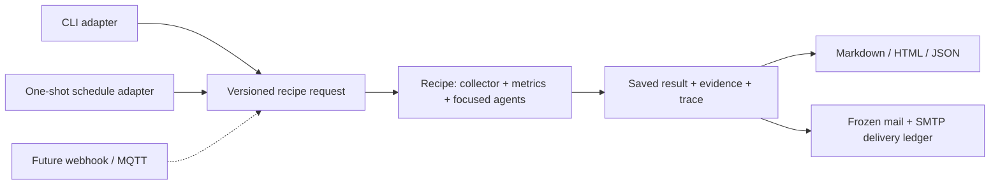
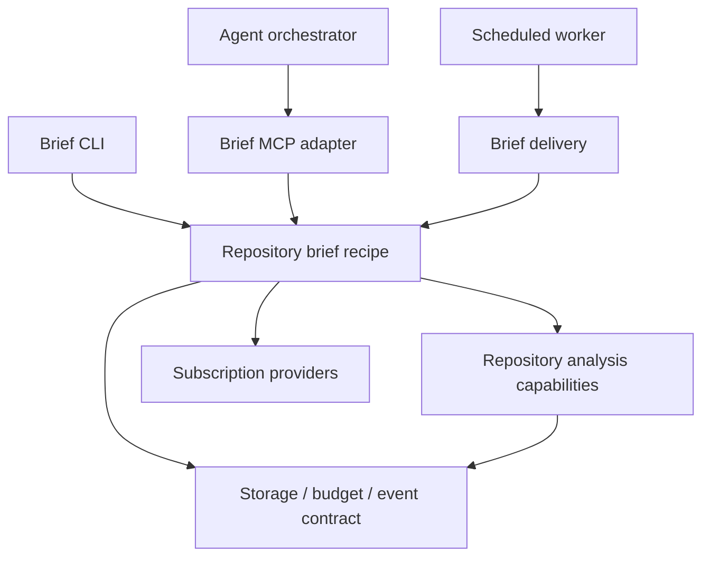

# Agent packages, recipes, and adapters

Living document. Rationale: [ADR-0010](../adr/0010-compose-a-repository-brief-from-bounded-evidence.md).
Delivery rationale: [ADR-0011](../adr/0011-separate-scheduled-analysis-from-mail-delivery.md).
Contracts: [scheduled delivery](../specs/scheduled-delivery.md), [repository brief](../specs/repository-brief.md), [discovery](../specs/agent-discovery.md).

## Overview

Onionsoup packages focused judgments with supporting deterministic functions and
composes them through ordinary application recipes. A trigger adapter translates
an event or command into a versioned request; a delivery adapter consumes a saved
result. Agents have no knowledge of the transport that invoked them.

## Design

### Private workspace packages

[ADR-0022](../adr/0022-package-capabilities-with-thin-host-applications.md) defines
private npm workspaces with coordinated versions. The
[package contract](../specs/workspace-packages.md) records exports, compiled releases,
host configuration and MCP job semantics. Root `src/repository-brief` and `src/delivery`
modules are compatibility forwards, not separate implementations.

| Package | Ownership |
| --- | --- |
| `repository-analysis` | Three agents, prompts, schemas, collection, metrics, manifests |
| `repository-brief` | Sequence, four admissions, record validation, events, rendering |
| `brief-delivery` | Schedule, occurrence ledger, SMTP and capture support |
| `brief-mcp` | Allowlisted asynchronous delegation and saved-job inspection |
| `providers` | Subscription adapters, explicit selection, development model policy |
| `runtime` | Small shared storage, budget, event-schema and text primitives |

For repository briefs, four thin applications select configuration: on-demand CLI, scheduled worker,
MCP stdio host and local mail capture. Packages cannot import applications or root
source. Public export checks and a relocated compiled-release test enforce that
boundary. Existing readiness/location and implementation workflows remain in `src/`
until a concrete next consumer justifies extraction; sandbox assets and historical
records stay where their existing qualification expects them.

The same theme capability runs separately for open issues and open PRs. It returns
member IDs and prose; host code computes counts. Health interpretation receives
metrics with their definitions and missing-data status. Action suggestions receive
metrics, item metadata, successful theme groups, and verified first-time PR authors.
The root record freezes actual inputs and retains original child records.

A package includes its public contract, callable implementation, prompt version,
supporting functions, limits, tests, and generated capability declaration. Runtime
credentials and model instances are supplied by the host. The recipe decides how
those ingredients compose, including skip/failure policy; it does not grant agents
new effects. Existing readiness/location agents retain their original jobs.

### Future trigger and delivery adapters

CLI, local files, scheduled ticks, SMTP delivery and repository-brief MCP tools are implemented. The
[schedule/delivery contract](../specs/scheduled-delivery.md) and
[backlog P8](../plans/backlog.md#phase-8--scheduled-delivery) govern the two host
adapters. A development capture relay saves mail locally without forwarding.
Webhook, MQTT and GitHub event listeners remain future work. All adapters converge
on the same recipe input and saved result rather than embed agent prompts:

- **Schedule:** choose repository/window, maximum suggestions and delivery target;
  submit a request with a stable scheduled-occurrence identity.
- **Generic webhook:** authenticate sender, validate an allowlisted request, deduplicate
  delivery IDs, and enqueue bounded work. Payload text cannot select credentials or
  expand permissions.
- **MQTT:** map configured topics to permitted recipe requests, handle duplicate
  deliveries and retained messages explicitly, and keep broker details outside agents.
- **GitHub events:** verify signatures, select allowed event/repository combinations,
  retain event identity, and debounce/coalesce bursts according to an explicit policy.
- **Email:** render and send an already saved result, retaining recipient/configuration,
  artifact hash and delivery identity. A send retry must not repeat agent analysis.
  An ambiguous send response needs reconciliation; do not claim exactly-once delivery.

The schedule and mail adapter use one local occurrence ledger and exclusive lock,
with a frozen configuration, brief and MIME payload. Analysis and delivery have
separate retry boundaries. Explicit operator configuration authorizes mail; model
output cannot choose a destination. Ambiguous SMTP outcomes require reconciliation.
Queues, distributed leases and the remaining event listeners remain deferred.

### Agent orchestration and the next domain

A chat agent can be the orchestrator: it discovers tools and delegates a bounded
brief job, then inspects the result. MCP is a transport adapter around the same
callable recipe. The orchestrator does not gain broader authority from discovery,
and narrative output cannot select credentials or invoke a different effect.
An application can import the recipe directly or host this adapter as a process.
Service/container boundaries are deployment choices, not agent boundaries.

The first homelab source is now `@onionsoup/truenas-source`, consumed by
`apps/homelab-cli`. It uses the owner's existing TrueNAS MCP executable, forces
read-only mode, and projects its health report into bounded count/coverage evidence.
[ADR-0023](../adr/0023-collect-read-only-truenas-evidence-through-existing-mcp.md) and
the [evidence contract](../specs/truenas-evidence.md) govern this integration in
[roadmap phase 22](../plans/roadmap.md#phase-22--read-only-truenas-evidence).
This deterministic step makes no model calls and needs no new agent judgment.

`@onionsoup/container-source` now supplies Docker, Podman and Incus inventory over
bounded SSH with fixed commands, standard host-key trust, and explicit account/socket/
cluster scope. It shares `apps/homelab-cli` with TrueNAS. See
[ADR-0024](../adr/0024-collect-container-inventory-over-bounded-ssh.md), the
[inventory contract](../specs/container-inventory.md) and
[roadmap phase 23](../plans/roadmap.md#phase-23--ssh-container-inventory).
`@onionsoup/kubernetes-source` adds three fixed k3s status reads: nodes, pods and
Argo CD Applications. Its explicit sudo option does not change container authority.
Both SSH sources share process bounds in `@onionsoup/runtime/ssh`.
`@onionsoup/homelab-brief` composes saved observations into a deterministic brief
with collection coverage, generation-time freshness and source hashes. This is a
recipe without a model; judgment can be added only for a separate demonstrated job.
See [ADR-0025](../adr/0025-compose-k3s-and-gitops-observations.md), the
[brief contract](../specs/homelab-brief.md) and
[roadmap phase 24](../plans/roadmap.md#phase-24--k3s-gitops-and-a-homelab-brief).

`@onionsoup/workload-triage` is the first focused homelab judgment: current versus
historical workload findings, or insufficient evidence. The separate workload
projection export in `@onionsoup/kubernetes-source/workloads` gathers deterministic
facts and keeps names in a local lookup. `@onionsoup/homelab-mcp` and
`apps/homelab-mcp` expose configured investigations and saved-source briefs to a chat
orchestrator. See [ADR-0026](../adr/0026-triage-workload-findings-through-bounded-evidence.md),
the [triage/MCP contract](../specs/workload-triage.md), and
[roadmap phase 25](../plans/roadmap.md#phase-25--workload-triage-and-homelab-mcp).

Synology remains a future source. A later focused agent can
interpret normalized evidence with provenance, without receiving management tools
or raw service credentials. Configure resource allowlists per source before live
access; repair or service mutation requires a separate explicit authority boundary.
The repository-brief release selects only its own apps and workspace dependencies,
so adding a homelab ingredient does not expand the OSS deployment.

### Deployment position

AgentLayer supplies the inner runtime: tool interfaces/executors, agent loops,
hooks, events and serializable state. Its current documentation leaves saving and
restoring state to the caller. The docs-agent example runs behind GitHub Actions
triggers. These patterns fit a thin host around Onionsoup's callable functions.
Our dependency remains pinned to 0.0.36; current upstream documentation is not a
claim that every later runtime feature is installed here.

HumanLayer's separate Agent Control Plane describes a Kubernetes-based agent/task
orchestrator and labels itself alpha. It is a future evaluation candidate, not an
Onionsoup dependency. Use the compiled release for a CLI, external timer or local stdio host, with its selected
subscription credentials. Choose deployment/queue infrastructure in response to
specific operational needs; do not require a service boundary for each agent.

## Operational notes

The on-demand command requires authenticated `gh` and a configured Copilot or
Codex subscription; the development model is Terra. It needs no target repository
checkout. API and model failures produce partial artifacts when possible. Existing
output paths are exclusive. Inspect running artifacts as unknown, then deliberately
start a new attempt if needed; `render` never resumes work.

Collection totals and theme samples have different coverage. Render denominators,
unknown histories and missing CI rather than assigning a generic repository health
score. Scheduled email preserves this evidence and correlates delivery events to the
original brief workflow. It omits raw agent state and nonportable local-file links.

## References

- Rationale: [ADR-0010](../adr/0010-compose-a-repository-brief-from-bounded-evidence.md).
- Contracts: [repository brief](../specs/repository-brief.md), [discovery](../specs/agent-discovery.md).
- Built in: [backlog P7](../plans/backlog.md#phase-7--repository-brief), [roadmap](../plans/roadmap.md).
- Context: [taco-bell composition](composable-agents.md).
- Upstream: [AgentLayer architecture](https://github.com/humanlayer/agentlayer/blob/main/packages/docs/content/introduction/architecture.md),
  [state persistence](https://github.com/humanlayer/agentlayer/blob/main/packages/docs/content/concepts/state.md),
  [docs-agent](https://github.com/humanlayer/agentlayer/tree/main/agents/docs-agent),
  [Agent Control Plane](https://github.com/humanlayer/agentcontrolplane).

The [operator console](operator-console.md), governed by
[ADR-0012](../adr/0012-operate-saved-workflows-through-a-local-console.md) and its
[contract](../specs/operator-console.md), is another host consumer of these recipes.
It joins saved briefs, delivery and an explicit investigation handoff in
[backlog P9](../plans/backlog.md#phase-9--operator-console). The
[investigation-to-PR exploration](investigation-to-pr.md) proposes later artifact
and authority boundaries; it does not add current effects.

### Workflow owners and model delegation

[ADR-0027](../adr/0027-observe-workflow-owners-and-prove-model-delegation.md)
adds a fixed Argo Workflow status projection to the existing source package. The
[versioned workload contract](../specs/workload-triage.md#workflow-owner-evidence-v2)
keeps historical evidence readable and distinguishes failed executions from outages.
The [conversational proof](../specs/homelab-delegation.md) is a consumer in `scripts/`,
not another service or agent package. AgentLayer selects MCP calls; host code owns
job admission, bounded waits and answer provenance. This proves the same narrow
capability can be delegated by a model as well as composed by deterministic recipes.
[Roadmap phase 26](../plans/roadmap.md#phase-26--workflow-owners-and-model-delegation)
qualifies this use before broader conversational deployment.

### Persistent conversational consumer

[ADR-0028](../adr/0028-separate-chat-sessions-from-domain-capabilities.md) separates
`@onionsoup/chat` (conversation lifecycle) from `@onionsoup/homelab-chat` (reviewed
capabilities/evidence policy) and `apps/chat-cli` (terminal and stdio transport).
The [chat contract](../specs/chat.md) allows another domain to supply a profile
without modifying the core or granting discovered tools automatic authority.
[Roadmap phase 27](../plans/roadmap.md#phase-27--persistent-chat-and-homelab-profile)
qualifies restart, follow-up evidence and refresh. This is a consumer/orchestrator;
it delegates the focused triage judgment and deterministic collection/composition.

### Shared local job service

[ADR-0029](../adr/0029-host-reviewed-capabilities-through-a-shared-job-api.md) adds
`@onionsoup/job-host` (generic lifecycle and HTTP client), `@onionsoup/host-capabilities`
(reviewed domain registry and homelab compatibility projection), and `apps/job-host`.
The [service contract](../specs/job-host.md) is consumed by chat and the scheduled
brief worker. The delivery package owns its remote-generation adapter so a portable
OSS brief release does not acquire homelab dependencies. Existing standalone MCP
hosts remain available. [Roadmap phase 28](../plans/roadmap.md#phase-28--shared-capability-job-host)
tracks the two-consumer proof.
